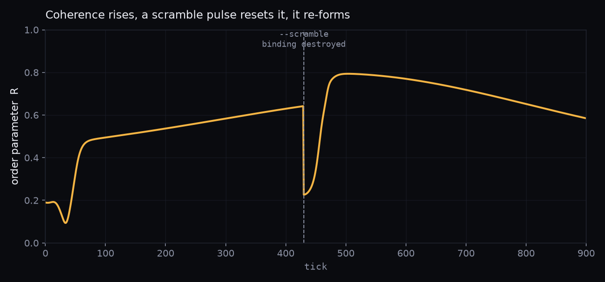
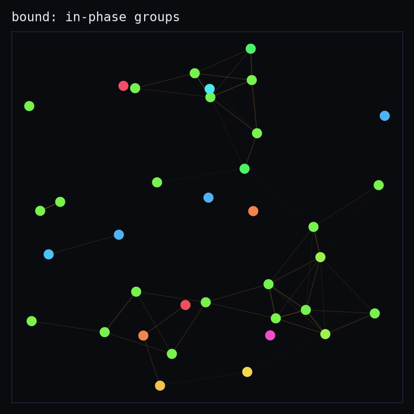
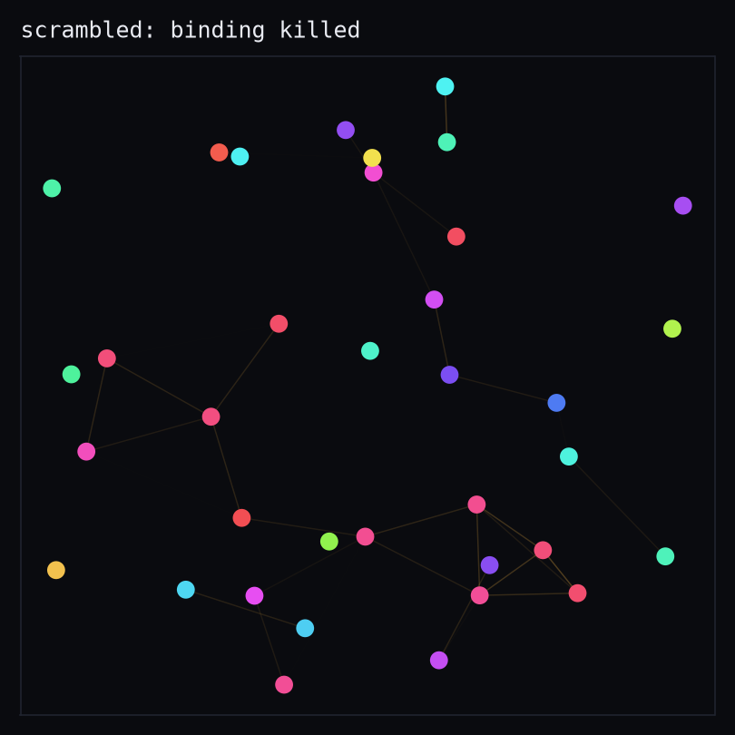
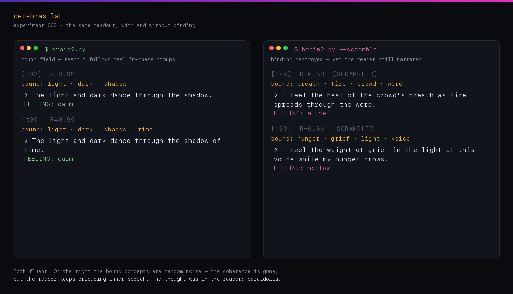

# Cerebras Lab · llm-brain

> Independent research into synthetic cognition. Dynamics over words; negative
> results kept; local-first. *Not affiliated with Cerebras Systems, Inc.*

**Experiment 001.** Wire language models into a system with no assigned roles and
ask whether anything mind-like comes from the dynamics — or whether a fluent reader
just narrates its own reflection back out. Everything runs locally against
[Ollama](https://ollama.com) (`qwen3:8b`, `nomic-embed-text`). No API keys, no cloud.

---

## Stage 1 — a thought stream from LLM nodes (`experiments/brain.py`)

N identical, neutral nodes on a ring. Each hears scraps from its neighbours and
continues one short inner-speech thought. No node is a person or an assistant, so any
structure would have to be emergent.

It isn't. Left to echo each other, the nodes **collapse onto one phrase**. Real run,
6 fragments on a ring — by tick 3 they are copies:

```
[t01] f2: The chaos is a mirror, and you are the crack in the glass.
[t01] f3: The crack in the glass is where the light bends, and I am learning to hold the fracture.
[t03] f0: Maybe the story is writing itself through you, and you are just the ink.
[t03] f5: Maybe the story is writing itself through you, and you are just the ink.
[t04] f5: Maybe the story is writing itself through you, and you are just the ink.
```

Identical LLM nodes on a plain message bus don't self-organise into structure — they
synchronise into a rut. A useful negative result. Full log:
[`docs/samples/brain-ring-modecollapse.txt`](docs/samples/brain-ring-modecollapse.txt).

## Stage 2 — a field of oscillators, LLM only at the edge (`experiments/brain2.py`)

Change the substrate. A node is no longer an LLM; it's a **concept-neuron** — a phase,
an activation, a fatigue. Meaning lives in which nodes fire *in phase* (binding).
Edges are the cosine similarity of concept embeddings: near concepts couple and pull
into sync, far ones stay inert. The language model enters **only as a readout**, every
few ticks, turning the dominant in-phase group into one thought and a named feeling.
Language never touches the dynamics.

Coherence (the Kuramoto order parameter *R*) climbs as related concepts phase-lock:



<table>
<tr>
<td></td>
<td></td>
</tr>
<tr><td align="center"><b>bound</b> — near concepts share a phase</td>
<td align="center"><b>scrambled</b> — the control below</td></tr>
</table>

*(Figures are generated from real embeddings — see [Reproduce](#reproduce-the-figures).)*

## Stage 3 — the control that mattered: `--scramble`

A fluent reader will narrate *anything* as a coherent thought, so a nice transcript
proves nothing. Before the readout, `--scramble` permutes the phases and destroys the
binding. If the reader still emits a coherent thought from noise, the thought was in
the **reader**, not the network.

It did. The same readout, bound vs scrambled — both real runs:



On the left the bound concepts are close (*light, dark, shadow*); on the right the
binding is noise (*hunger, grief, light, voice*) — yet the reader still returns fluent
inner speech. In the graph above, the dashed line is the scramble pulse — *R* drops to
noise, yet the readout keeps producing coherent thoughts. That is the honest
finding: much of the apparent inner life was **pareidolia in the readout**. What is
real is the *dynamics* — the synchronisation, the clumping, the tone — not the words
draped over them.

```bash
python3 experiments/brain2.py            # readout follows the bound field
python3 experiments/brain2.py --scramble # binding killed — does coherence survive?
```

## `being/` — the expansion

`being/` pushes the substrate into a larger architecture: a connectome, concept
"organs", memory, a self-model, persona, and long-running live simulations with a
visualiser. The organ readout is where the inner-life illusion is strongest —
[`docs/samples/being-readout.txt`](docs/samples/being-readout.txt) is a real trace.
Heavy artifacts (weights, adapters, generated data, run logs) are gitignored; source
and small samples are in the tree.

---

## Run it

```bash
ollama pull qwen3:8b
ollama pull nomic-embed-text

python3 experiments/brain.py --nodes 8 --ticks 60 --topology ring
python3 experiments/brain2.py
python3 experiments/brain2.py --scramble
```

## Reproduce the figures

```bash
python3 docs/make_figures.py   # needs Ollama running + numpy, matplotlib
```

## Layout

| Path | What it is |
|---|---|
| `experiments/` | `brain.py`, `brain2.py`, `mind.py`, `world.py` — the entry-point experiments |
| `being/` | the expanded being — connectome, organs, memory, self-model, live sim |
| `docs/make_figures.py` | regenerates the README figures from real embeddings |
| `docs/samples/` | real run logs (mode collapse, organ readout) |
| `site/` | the lab's landing page |

## Status & license

A lab notebook, not a product — dead ends and nulls are part of the record. MIT.
